# ADS2GO System - Visual Entity Relationship Diagram

## Visual ERD Diagram (Mermaid)

```mermaid
erDiagram
    USER ||--o{ AD : creates
    USER ||--o{ PAYMENT : makes
    USER ||--o{ USERREPORT : submits
    USER ||--o{ USERANALYTICS : has
    USER ||--o{ NOTIFICATION : receives
    USER ||--o{ COMPANYAD : creates
    
    ADMIN ||--o{ USERREPORT : responds_to
    ADMIN ||--o{ DRIVERREPORT : responds_to
    ADMIN ||--o{ CONTACTMESSAGE : replies_to
    ADMIN ||--o{ NOTIFICATION : receives
    
    SUPERADMIN ||--o{ ADMIN : manages
    SUPERADMIN ||--o{ USER : manages
    SUPERADMIN ||--o{ DRIVERSALARYPRICING : creates
    SUPERADMIN ||--o{ DRIVERSALARYCALCULATION : approves
    SUPERADMIN ||--o{ PRICINGCONFIG : creates
    SUPERADMIN ||--o{ NOTIFICATION : receives
    
    DRIVER ||--|| MATERIAL : assigned_to
    DRIVER ||--o{ ADSDEPLOYMENT : has
    DRIVER ||--o{ DRIVERREPORT : submits
    DRIVER ||--o{ DRIVERSALARYCALCULATION : earns
    DRIVER ||--o{ DEVICETRACKING : generates
    DRIVER ||--o{ NOTIFICATION : receives
    DRIVER ||--o| TABLET : uses
    
    MATERIAL ||--o{ ADSDEPLOYMENT : hosts
    MATERIAL ||--o{ DEVICETRACKING : generates
    MATERIAL ||--o{ QRSCANTRACKING : generates
    MATERIAL ||--o{ MATERIALTRACKING : tracked_by
    MATERIAL ||--o{ MATERIALUSAGEHISTORY : has_history
    MATERIAL ||--|| TABLET : has_lcd
    
    AD ||--o{ PAYMENT : requires
    AD ||--o{ ADSDEPLOYMENT : deployed_as
    AD ||--o{ DEVICETRACKING : tracked_in
    AD ||--o{ QRSCANTRACKING : generates
    AD ||--o{ NOTIFICATION : triggers
    AD }o--|| ADSPLAN : uses
    
    ADSPLAN ||--o{ AD : defines
    ADSPLAN ||--o{ PAYMENT : referenced_in
    
    PAYMENT }o--|| USER : made_by
    PAYMENT }o--|| AD : for
    PAYMENT }o--o| ADSPLAN : uses
    
    ADSDEPLOYMENT }o--|| MATERIAL : deployed_on
    ADSDEPLOYMENT }o--|| DRIVER : owned_by
    ADSDEPLOYMENT }o--|| AD : contains
    ADSDEPLOYMENT }o--o| USER : created_by
    
    TABLET }o--|| MATERIAL : registered_for
    TABLET ||--o{ DEVICETRACKING : generates
    
    DEVICETRACKING }o--|| MATERIAL : tracks
    DEVICETRACKING }o--|| DRIVER : belongs_to
    DEVICETRACKING ||--o{ AD : plays
    
    QRSCANTRACKING }o--|| AD : scanned_from
    QRSCANTRACKING }o--|| MATERIAL : scanned_on
    
    DRIVERSALARYCALCULATION }o--|| DRIVER : for
    DRIVERSALARYCALCULATION }o--|| MATERIAL : based_on
    DRIVERSALARYCALCULATION }o--|| DRIVERSALARYPRICING : uses_rates
    
    DRIVERSALARYPRICING }o--|| SUPERADMIN : created_by
    
    MATERIALTRACKING }o--|| MATERIAL : tracks
    MATERIALTRACKING }o--|| DRIVER : uploaded_by
    
    MATERIALUSAGEHISTORY }o--|| MATERIAL : history_of
    MATERIALUSAGEHISTORY }o--|| DRIVER : assigned_to
    
    CONTACTMESSAGE }o--|| USER : from
    CONTACTMESSAGE ||--o{ ADMIN : replied_by
    
    NOTIFICATION }o--|| USER : to_user
    NOTIFICATION }o--|| ADMIN : to_admin
    NOTIFICATION }o--|| DRIVER : to_driver
    NOTIFICATION }o--|| SUPERADMIN : to_superadmin
    
    USER {
        ObjectId id PK
        String email UK
        String password
        String firstName
        String lastName
        String companyName
        String role
        Boolean isEmailVerified
        Boolean isArchived
        Date createdAt
        Date updatedAt
    }
    
    ADMIN {
        ObjectId id PK
        String email UK
        String password
        String firstName
        String lastName
        String role
        Boolean isActive
        Object permissions
        Date createdAt
        Date updatedAt
    }
    
    SUPERADMIN {
        ObjectId id PK
        String email UK
        String password
        String firstName
        String lastName
        String role
        Boolean isActive
        Object permissions
        Date createdAt
        Date updatedAt
    }
    
    DRIVER {
        ObjectId id PK
        String driverId UK
        String email UK
        String password
        String firstName
        String lastName
        String vehiclePlateNumber
        String vehicleType
        String accountStatus
        String reviewStatus
        ObjectId materialId FK
        Float currentBalance
        Float totalEarnings
        Boolean isArchived
        Date createdAt
        Date updatedAt
    }
    
    MATERIAL {
        ObjectId id PK
        String materialId UK
        String materialType
        String category
        String vehicleType
        String driverId FK
        String status
        Object location
        Date assignedDate
        Date createdAt
        Date updatedAt
    }
    
    AD {
        ObjectId id PK
        ObjectId userId FK
        ObjectId planId FK
        Array materialId
        Array targetDevices
        String title
        String adFormat
        String adType
        String mediaFile
        Float price
        Float totalPrice
        Int durationDays
        Int numberOfDevices
        String status
        String adStatus
        String paymentStatus
        Date startTime
        Date endTime
        Int impressions
        Boolean isArchived
        Date createdAt
        Date updatedAt
    }
    
    ADSPLAN {
        ObjectId id PK
        String name
        String description
        Int durationDays
        String category
        String materialType
        String vehicleType
        Int numberOfDevices
        Int adLengthSeconds
        Int playsPerDayPerDevice
        Float pricePerPlay
        Float totalPrice
        String status
        Date createdAt
        Date updatedAt
    }
    
    PAYMENT {
        ObjectId id PK
        ObjectId userId FK
        ObjectId adsId FK
        ObjectId planID FK
        String paymentType
        Float amount
        String receiptId UK
        String paymentStatus
        Date paymentDate
        Date createdAt
        Date updatedAt
    }
    
    ADSDEPLOYMENT {
        ObjectId id PK
        String adDeploymentId UK
        String materialId FK
        String driverId FK
        ObjectId userId FK
        ObjectId adId FK
        Array lcdSlots
        Date startTime
        Date endTime
        String currentStatus
        Date deployedAt
        Date createdAt
        Date updatedAt
    }
    
    TABLET {
        ObjectId id PK
        String materialId FK
        String carGroupId
        Array tablets
        Date createdAt
        Date updatedAt
    }
    
    DEVICETRACKING {
        ObjectId id PK
        String materialId FK
        String carGroupId
        String screenType
        Date date
        Array slots
        Object currentLocation
        Float totalDistance
        Float totalHours
        Float currentHours
        Boolean isCompliant
        Int totalAdPlays
        Int totalQRScans
        Array adPlayback
        Array qrScans
        Date createdAt
        Date updatedAt
    }
    
    QRSCANTRACKING {
        ObjectId id PK
        String adId FK
        String materialId FK
        Int slotNumber
        Date scanTimestamp
        String qrCodeUrl
        Object location
        String deviceType
        Boolean converted
        Date createdAt
        Date updatedAt
    }
    
    DRIVERSALARYCALCULATION {
        ObjectId id PK
        String driverId FK
        ObjectId materialId FK
        String deviceId
        Object calculationPeriod
        Object rawData
        Object pricingConfig
        Object calculations
        String status
        ObjectId approvedBy FK
        Date approvedAt
        Date paidAt
        Boolean isActive
        Date createdAt
        Date updatedAt
    }
    
    DRIVERSALARYPRICING {
        ObjectId id PK
        String vehicleType
        String category
        String materialType
        Float distanceRate
        Float hoursRate
        Boolean isActive
        ObjectId createdBy FK
        Date createdAt
        Date updatedAt
    }
    
    PRICINGCONFIG {
        ObjectId id PK
        String materialType
        String vehicleType
        String category
        Float basePricePerPlay
        Object durationMultipliers
        Boolean isActive
        ObjectId createdBy FK
        Date createdAt
        Date updatedAt
    }
    
    MATERIALTRACKING {
        ObjectId id PK
        ObjectId materialId FK
        ObjectId driverId FK
        String materialCondition
        Array monthlyPhotos
        String photoComplianceStatus
        Date lastPhotoUpload
        Date nextPhotoDue
        Date createdAt
        Date updatedAt
    }
    
    MATERIALUSAGEHISTORY {
        ObjectId id PK
        ObjectId materialId FK
        String driverId FK
        Date assignedAt
        Date unassignedAt
        Date mountedAt
        Date dismountedAt
        Int usageDuration
        String assignmentReason
        Boolean isActive
        Date createdAt
        Date updatedAt
    }
    
    COMPANYAD {
        ObjectId id PK
        String title
        String mediaFile
        String adFormat
        Int duration
        Boolean isActive
        Int priority
        Int playCount
        ObjectId createdBy FK
        Date createdAt
        Date updatedAt
    }
    
    CONTACTMESSAGE {
        ObjectId id PK
        ObjectId userId FK
        String subject
        String message
        String status
        Array adminReplies
        Date createdAt
        Date updatedAt
    }
    
    USERREPORT {
        ObjectId id PK
        ObjectId userId FK
        String title
        String description
        String reportType
        String status
        Array attachments
        String adminNotes
        ObjectId adminNotesBy FK
        Date createdAt
        Date updatedAt
    }
    
    DRIVERREPORT {
        ObjectId id PK
        String driverId FK
        String title
        String description
        String reportType
        String status
        Array attachments
        String adminNotes
        ObjectId adminNotesBy FK
        Date createdAt
        Date updatedAt
    }
    
    NOTIFICATION {
        ObjectId userId PK
        String userRole
        Array notifications
        Int unreadCount
        Object notificationPreferences
        Date createdAt
        Date updatedAt
    }
    
    USERANALYTICS {
        ObjectId userId PK
        Object summary
        Array adPerformance
        Array dailyStats
        Array deviceStats
        String period
        Date lastUpdated
        Boolean isActive
        Date createdAt
        Date updatedAt
    }
```



## Simplified Relationship Diagram

```
┌─────────────┐
│    USER     │
└──────┬──────┘
       │
       ├─────── creates ───────► ┌──────────┐
       │                          │    AD    │
       │                          └────┬─────┘
       │                               │
       │                               ├─────── deployed_as ──────► ┌──────────────┐
       │                               │                             │ ADSDEPLOYMENT│
       │                               │                             └──────┬───────┘
       │                               │                                      │
       └─────── makes ───────► ┌─────────────┐                              │
                               │   PAYMENT   │                              │
                               └──────┬──────┘                              │
                                      │                                      │
                                      └─────── for ──────────────────────────┘
                                                       │
                                                       │
┌──────────────┐                                       │
│   MATERIAL   │◄────────────────── hosted_on ────────┘
└──────┬───────┘
       │
       ├─────── assigned_to ──────► ┌──────────┐
       │                             │  DRIVER  │
       ├─────── has_lcd ────────────►│          │
       │                             └────┬─────┘
       │                                  │
       │                                  ├─────── owns ──────► ┌──────────────┐
       │                                  │                     │ ADSDEPLOYMENT│
       │                                  │                     └──────────────┘
       │                                  │
       │                                  ├─────── generates ───► ┌──────────────┐
       │                                  │                       │DEVICETRACKING│
       └─────── generates ────────────────┘                       └──────┬───────┘
                                                                          │
                                                                          ├─────── tracks ──────► ┌──────────┐
                                                                          │                       │   AD     │
                                                                          └─────── tracks ──────► └──────────┘
```

## Key Relationships Summary

### One-to-Many Relationships:
- **USER → AD** (1 user creates many ads)
- **USER → PAYMENT** (1 user makes many payments)
- **AD → ADSDEPLOYMENT** (1 ad deployed to many materials)
- **MATERIAL → ADSDEPLOYMENT** (1 material hosts many deployments)
- **DRIVER → ADSDEPLOYMENT** (1 driver has many deployments)
- **AD → QRSCANTRACKING** (1 ad generates many QR scans)
- **MATERIAL → DEVICETRACKING** (1 material generates daily tracking records)
- **SUPERADMIN → ADMIN** (1 superadmin manages many admins)
- **SUPERADMIN → DRIVERSALARYPRICING** (1 superadmin creates many pricing configs)
- **DRIVER → DRIVERSALARYCALCULATION** (1 driver has many salary calculations)

### One-to-One Relationships:
- **MATERIAL ↔ DRIVER** (1 material assigned to 1 driver)
- **MATERIAL ↔ TABLET** (1 LCD material has 1 tablet config)
- **USER ↔ USERANALYTICS** (1 user has 1 analytics record)
- **USER ↔ NOTIFICATION** (1 user has 1 notification document)

### Many-to-Many Relationships:
- **AD ↔ MATERIAL** (many ads deployed to many materials via ADSDEPLOYMENT)
- **AD ↔ DRIVER** (many ads displayed by many drivers via MATERIAL and ADSDEPLOYMENT)

### Hierarchical Relationships:
- **SUPERADMIN → ADMIN → USER** (management hierarchy)
- **SUPERADMIN → PRICINGCONFIG → ADSPLAN → AD** (pricing hierarchy)
- **SUPERADMIN → DRIVERSALARYPRICING → DRIVERSALARYCALCULATION → DRIVER** (salary hierarchy)

